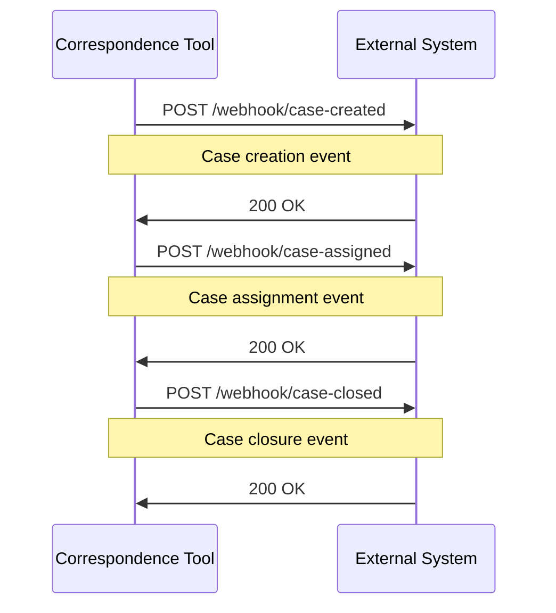
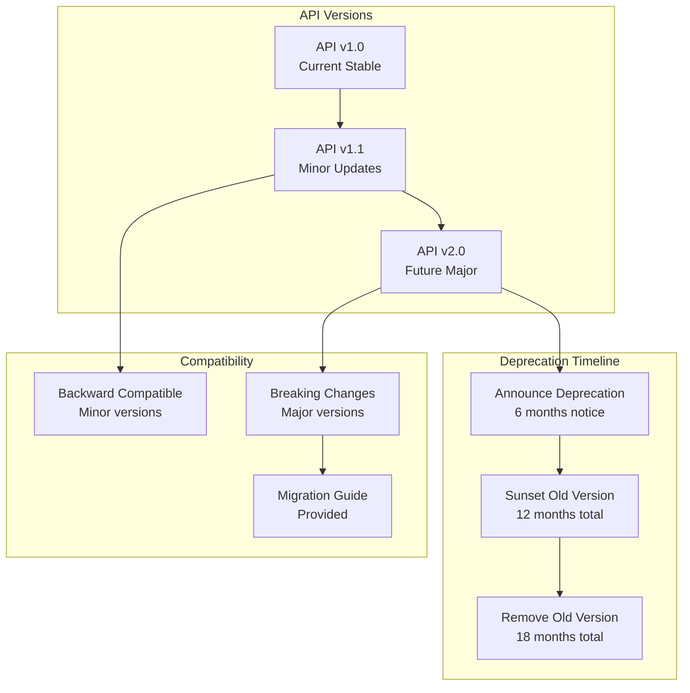

# API Documentation

## API Overview

The Correspondence Tool Staff provides both internal APIs for system integration and external APIs for government services to interact with the case management system.

```mermaid
graph TB
    subgraph "API Endpoints"
        REST_API[REST API v1]
        RPI_API[RPI API v1/v2]
        INTERNAL_API[Internal API]
        WEBHOOK_API[Webhook API]
    end
    
    subgraph "Authentication"
        API_KEY[API Key Authentication]
        JWT[JWT Token Authentication]
        OAUTH[OAuth 2.0]
        HMAC[HMAC Signature]
    end
    
    subgraph "External Integrations"
        SSCL[SSCL Systems]
        GOV_NOTIFY[GOV.UK Notify]
        DPS[Digital Prison Service]
        PROBATION[Probation Services]
    end
    
    subgraph "Internal Consumers"
        WAREHOUSE[Data Warehouse]
        REPORTING[Reporting System]
        MONITORING[Monitoring Tools]
        ADMIN_TOOLS[Admin Tools]
    end
    
    REST_API --> API_KEY
    RPI_API --> JWT
    INTERNAL_API --> OAUTH
    WEBHOOK_API --> HMAC
    
    REST_API --> SSCL
    RPI_API --> DPS
    REST_API --> GOV_NOTIFY
    
    INTERNAL_API --> WAREHOUSE
    INTERNAL_API --> REPORTING
    WEBHOOK_API --> MONITORING
    REST_API --> ADMIN_TOOLS
```



## REST API v1

### Authentication

```http
POST /api/v1/auth/token
Content-Type: application/json

{
  "api_key": "your-api-key",
  "secret": "your-secret"
}
```

```http
HTTP/1.1 200 OK
Content-Type: application/json

{
  "token": "eyJ0eXAiOiJKV1QiLCJhbGciOiJIUzI1NiJ9...",
  "expires_at": "2025-08-17T10:30:00Z",
  "token_type": "Bearer"
}
```

### Case Management Endpoints

#### Create Case

```http
POST /api/v1/cases
Authorization: Bearer {token}
Content-Type: application/json

{
  "case": {
    "type": "Case::FOI::Standard",
    "name": "John Doe",
    "email": "john.doe@example.com",
    "subject": "Request for information about...",
    "message": "I would like to request information about...",
    "received_date": "2025-08-16",
    "requester_type": "member_of_the_public"
  }
}
```

```http
HTTP/1.1 201 Created
Content-Type: application/json

{
  "case": {
    "id": 12345,
    "number": "FOI-250816-001",
    "type": "Case::FOI::Standard",
    "name": "John Doe",
    "email": "john.doe@example.com",
    "subject": "Request for information about...",
    "workflow_state": "unassigned",
    "received_date": "2025-08-16",
    "deadline": "2025-09-15",
    "created_at": "2025-08-16T09:00:00Z",
    "updated_at": "2025-08-16T09:00:00Z",
    "links": {
      "self": "/api/v1/cases/12345",
      "assignments": "/api/v1/cases/12345/assignments",
      "attachments": "/api/v1/cases/12345/attachments"
    }
  }
}
```

#### Get Case

```http
GET /api/v1/cases/{id}
Authorization: Bearer {token}
```

```http
HTTP/1.1 200 OK
Content-Type: application/json

{
  "case": {
    "id": 12345,
    "number": "FOI-250816-001",
    "type": "Case::FOI::Standard",
    "name": "John Doe",
    "email": "john.doe@example.com",
    "subject": "Request for information about...",
    "message": "I would like to request information about...",
    "workflow_state": "drafting",
    "received_date": "2025-08-16",
    "deadline": "2025-09-15",
    "created_at": "2025-08-16T09:00:00Z",
    "updated_at": "2025-08-16T10:30:00Z",
    "assignments": [
      {
        "id": 67890,
        "team": {
          "id": 42,
          "name": "Digital Services Team",
          "team_type": "responding"
        },
        "user": {
          "id": 123,
          "name": "Jane Smith",
          "email": "jane.smith@justice.gov.uk"
        },
        "state": "accepted",
        "role": "responder",
        "assigned_at": "2025-08-16T09:30:00Z"
      }
    ],
    "transitions": [
      {
        "id": 98765,
        "event": "assign_responder",
        "from_state": "unassigned",
        "to_state": "awaiting_responder",
        "acting_user": "System",
        "created_at": "2025-08-16T09:30:00Z"
      }
    ]
  }
}
```

#### Search Cases

```http
GET /api/v1/cases?q=search_term&state=drafting&type=FOI&page=1&per_page=25
Authorization: Bearer {token}
```

```http
HTTP/1.1 200 OK
Content-Type: application/json

{
  "cases": [
    {
      "id": 12345,
      "number": "FOI-250816-001",
      "type": "Case::FOI::Standard",
      "subject": "Request for information about...",
      "workflow_state": "drafting",
      "received_date": "2025-08-16",
      "deadline": "2025-09-15"
    }
  ],
  "meta": {
    "total_count": 150,
    "page": 1,
    "per_page": 25,
    "total_pages": 6
  },
  "links": {
    "self": "/api/v1/cases?page=1",
    "next": "/api/v1/cases?page=2",
    "last": "/api/v1/cases?page=6"
  }
}
```

### Assignment Endpoints

#### Assign Case to Team

```http
POST /api/v1/cases/{id}/assignments
Authorization: Bearer {token}
Content-Type: application/json

{
  "assignment": {
    "team_id": 42,
    "role": "responder",
    "message": "Please handle this FOI request"
  }
}
```

```http
HTTP/1.1 201 Created
Content-Type: application/json

{
  "assignment": {
    "id": 67890,
    "case_id": 12345,
    "team_id": 42,
    "user_id": null,
    "state": "pending",
    "role": "responder",
    "assigned_at": "2025-08-16T10:00:00Z",
    "message": "Please handle this FOI request"
  }
}
```

### Attachment Endpoints

#### Upload Attachment

```http
POST /api/v1/cases/{id}/attachments
Authorization: Bearer {token}
Content-Type: multipart/form-data

file: (binary data)
upload_comment: "Response documents"
```

```http
HTTP/1.1 201 Created
Content-Type: application/json

{
  "attachment": {
    "id": 54321,
    "case_id": 12345,
    "filename": "response.pdf",
    "content_type": "application/pdf",
    "file_size": 2048576,
    "upload_comment": "Response documents",
    "created_at": "2025-08-16T11:00:00Z",
    "download_url": "/api/v1/attachments/54321/download"
  }
}
```

## RPI (Reporting & Performance Indicators) API

### RPI v2 Endpoints

The RPI API provides performance and statistical data for reporting purposes.

#### Get Case Statistics

```http
GET /api/rpi/v2/statistics
Authorization: Bearer {token}
Content-Type: application/json

{
  "period": {
    "start_date": "2025-07-01",
    "end_date": "2025-07-31"
  },
  "filters": {
    "case_types": ["FOI", "SAR"],
    "teams": [42, 43, 44]
  }
}
```

```http
HTTP/1.1 200 OK
Content-Type: application/json

{
  "statistics": {
    "period": {
      "start_date": "2025-07-01",
      "end_date": "2025-07-31"
    },
    "totals": {
      "cases_received": 245,
      "cases_closed": 198,
      "cases_in_progress": 47,
      "average_response_time_days": 18.5
    },
    "by_type": {
      "FOI": {
        "received": 180,
        "closed": 142,
        "in_progress": 38,
        "average_response_time_days": 16.2
      },
      "SAR": {
        "received": 65,
        "closed": 56,
        "in_progress": 9,
        "average_response_time_days": 24.8
      }
    },
    "performance_metrics": {
      "on_time_responses": 89.4,
      "breached_deadlines": 10.6,
      "escalations": 15
    }
  }
}
```

## Webhook API

### Case Event Webhooks



#### Webhook Registration

```http
POST /api/v1/webhooks
Authorization: Bearer {token}
Content-Type: application/json

{
  "webhook": {
    "url": "https://external-system.example.com/webhooks/correspondence-tool",
    "events": ["case.created", "case.assigned", "case.closed"],
    "secret": "webhook-secret-key",
    "active": true
  }
}
```

#### Webhook Payload Example

```http
POST /webhooks/correspondence-tool
X-CTS-Signature: sha256=1234567890abcdef...
Content-Type: application/json

{
  "event": "case.created",
  "timestamp": "2025-08-16T09:00:00Z",
  "data": {
    "case": {
      "id": 12345,
      "number": "FOI-250816-001",
      "type": "Case::FOI::Standard",
      "workflow_state": "unassigned",
      "received_date": "2025-08-16",
      "deadline": "2025-09-15"
    }
  }
}
```

## Internal API Endpoints

### Health Check

```http
GET /api/health
```

```http
HTTP/1.1 200 OK
Content-Type: application/json

{
  "status": "healthy",
  "timestamp": "2025-08-16T12:00:00Z",
  "services": {
    "database": "healthy",
    "redis": "healthy",
    "background_jobs": "healthy",
    "external_apis": {
      "gov_notify": "healthy",
      "s3_storage": "healthy"
    }
  },
  "metrics": {
    "response_time_ms": 45,
    "active_connections": 12,
    "queue_depth": 3
  }
}
```

### System Metrics

```http
GET /api/metrics
Authorization: Bearer {token}
```

```http
HTTP/1.1 200 OK
Content-Type: application/json

{
  "metrics": {
    "application": {
      "requests_per_minute": 150,
      "average_response_time": 250,
      "error_rate": 0.01
    },
    "database": {
      "active_connections": 12,
      "query_time_avg": 25,
      "slow_queries": 2
    },
    "background_jobs": {
      "queue_depth": 3,
      "processed_per_minute": 45,
      "failed_jobs": 0
    }
  }
}
```

## Error Handling

### Standard Error Response Format

```http
HTTP/1.1 422 Unprocessable Entity
Content-Type: application/json

{
  "error": {
    "code": "VALIDATION_ERROR",
    "message": "The request contains invalid data",
    "details": {
      "email": ["is not a valid email address"],
      "subject": ["cannot be blank"]
    },
    "timestamp": "2025-08-16T12:00:00Z",
    "request_id": "req_1234567890abcdef"
  }
}
```

### Error Codes Reference

| HTTP Status | Error Code | Description |
|-------------|------------|-------------|
| 400 | BAD_REQUEST | Invalid request format |
| 401 | UNAUTHORIZED | Authentication required |
| 403 | FORBIDDEN | Insufficient permissions |
| 404 | NOT_FOUND | Resource not found |
| 422 | VALIDATION_ERROR | Invalid data provided |
| 429 | RATE_LIMIT_EXCEEDED | Too many requests |
| 500 | INTERNAL_ERROR | Server error |
| 503 | SERVICE_UNAVAILABLE | Service temporarily unavailable |

## Rate Limiting

```http
HTTP/1.1 200 OK
X-RateLimit-Limit: 1000
X-RateLimit-Remaining: 995
X-RateLimit-Reset: 1692186000
Content-Type: application/json
```

Rate limiting is applied per API key:
- **Standard tier**: 1,000 requests per hour
- **Premium tier**: 10,000 requests per hour
- **Burst allowance**: Up to 100 requests per minute

## API Versioning Strategy



## Integration Examples

### Government Service Integration

```ruby
# Example: External service consuming the API
class CorrespondenceToolClient
  BASE_URL = 'https://correspondence-tool.service.gov.uk/api/v1'
  
  def initialize(api_key:, secret:)
    @api_key = api_key
    @secret = secret
    @token = authenticate
  end
  
  def create_case(case_data)
    response = http_client.post(
      "#{BASE_URL}/cases",
      json: { case: case_data },
      headers: auth_headers
    )
    
    handle_response(response)
  end
  
  def get_case(case_id)
    response = http_client.get(
      "#{BASE_URL}/cases/#{case_id}",
      headers: auth_headers
    )
    
    handle_response(response)
  end
  
  private
  
  def authenticate
    response = http_client.post(
      "#{BASE_URL}/auth/token",
      json: {
        api_key: @api_key,
        secret: @secret
      }
    )
    
    JSON.parse(response.body)['token']
  end
  
  def auth_headers
    {
      'Authorization' => "Bearer #{@token}",
      'Content-Type' => 'application/json',
      'X-API-Version' => '1.0'
    }
  end
end
```

### Webhook Handler Example

```ruby
# Example: Handling webhooks from the Correspondence Tool
class WebhookController < ApplicationController
  skip_before_action :verify_authenticity_token
  
  def correspondence_tool
    verify_signature!
    
    case params[:event]
    when 'case.created'
      handle_case_created(params[:data][:case])
    when 'case.assigned'
      handle_case_assigned(params[:data][:case])
    when 'case.closed'
      handle_case_closed(params[:data][:case])
    end
    
    head :ok
  end
  
  private
  
  def verify_signature!
    expected_signature = OpenSSL::HMAC.hexdigest(
      'sha256',
      ENV['WEBHOOK_SECRET'],
      request.raw_post
    )
    
    provided_signature = request.headers['X-CTS-Signature']&.sub('sha256=', '')
    
    unless Rack::Utils.secure_compare(expected_signature, provided_signature)
      head :unauthorized
    end
  end
  
  def handle_case_created(case_data)
    # Process new case notification
    logger.info "New case created: #{case_data[:number]}"
  end
end
```
