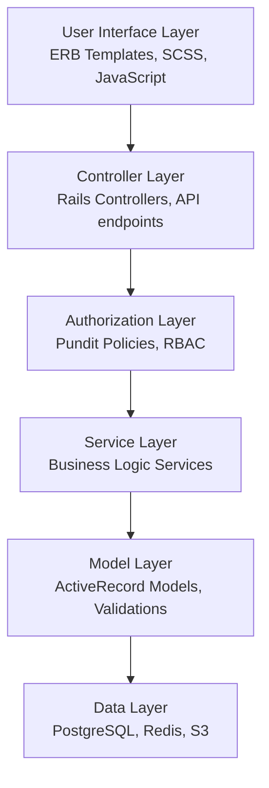

# Architecture Summary

## Quick Reference

This document provides a high-level summary of the Correspondence Tool Staff architecture with links to detailed documentation.

## System Overview

The Correspondence Tool Staff is a Ruby on Rails application designed for managing government correspondence including FOI requests, SAR cases, and complaint handling. The system follows a service-oriented architecture with clear separation of concerns.

### Key Characteristics
- **Type**: Rails Monolith with Service Layer
- **Database**: PostgreSQL with Redis caching
- **Background Processing**: Sidekiq
- **Authentication**: Government SSO integration
- **Authorization**: Policy-based (Pundit)
- **State Management**: Custom state machines
- **Deployment**: Containerized (Docker/Kubernetes)

## Architecture Layers



## Core Components

### 1. Case Management
- **Models**: `Case::Base` hierarchy with FOI, SAR, ICO, and Complaint subtypes
- **Services**: Create, assign, approve, close case workflows
- **State Machines**: Configurable workflow management
- **Policies**: Fine-grained authorization rules

### 2. User & Team Management
- **Models**: `User`, `Team` hierarchy (Business Groups, Directorates, Business Units)
- **Roles**: Permission-based role assignments
- **Services**: Team assignment and user management

### 3. Document Management
- **Attachments**: File upload and storage (S3/local)
- **Templates**: Standard response templates
- **Generation**: Automated document creation

### 4. Workflow Management
- **Assignments**: Multi-stage assignment process
- **Approvals**: DACU clearance workflows
- **Deadlines**: Statutory deadline tracking
- **Notifications**: Email/SMS via GOV.UK Notify

## Key Design Patterns

### Service Objects
```ruby
class CaseCreateService
  def self.call(user:, case_type:, params:)
    new(user: user, case_type: case_type, params: params).call
  end
  
  def call
    validate_permissions!
    create_case
    assign_initial_team
    send_notifications
    case
  end
end
```

### State Machines
```yaml
# Case workflow states
states:
  - unassigned
  - awaiting_responder
  - accepted
  - drafting
  - pending_dacu_clearance
  - awaiting_dispatch
  - responded
  - closed
```

### Policy Authorization
```ruby
class Case::BasePolicy < ApplicationPolicy
  def show?
    user.can_view_case?(record) || assigned_to_user_team?
  end
  
  def update?
    user.manager? || assigned_responder?
  end
end
```

## Integration Points

### External Systems
- **GOV.UK Notify**: Email and SMS notifications
- **Government SSO**: User authentication
- **SSCL**: Shared services integration
- **AWS S3**: Document storage
- **Digital Prison Service**: Offender data

### Internal APIs
- **REST API v1**: Case management operations
- **RPI API**: Reporting and performance indicators
- **Webhook API**: Event notifications
- **Health/Metrics**: System monitoring

## Security Features

- **Authentication**: Multi-factor authentication via Government SSO
- **Authorization**: Role-based access control with policies
- **Data Protection**: TLS 1.3 in transit, AES-256 at rest
- **Audit Logging**: Comprehensive activity tracking
- **Security Headers**: CSRF, XSS, and content security policies

## Performance & Scalability

- **Horizontal Scaling**: Load-balanced application instances
- **Database**: Read replicas and connection pooling
- **Caching**: Redis for sessions and frequently accessed data
- **Background Jobs**: Asynchronous processing with Sidekiq
- **CDN**: Static asset delivery

## Monitoring & Observability

- **Error Tracking**: Sentry integration
- **Metrics**: Prometheus with Grafana dashboards
- **Logging**: Centralized logging with structured formats
- **Health Checks**: Application and dependency monitoring
- **Alerting**: Automated incident response

## Deployment Architecture

### Environments
- **Development**: Docker Compose with mocked external services
- **Staging**: GOV.UK PaaS deployment with test integrations
- **Production**: Kubernetes cluster with full integrations

### CI/CD Pipeline
1. **Code Quality**: RSpec tests, Rubocop linting, Brakeman security
2. **Build**: Docker image creation with dependency caching
3. **Staging**: Automated deployment with smoke tests
4. **Production**: Blue-green deployment with rollback capability

## Documentation Structure

```
docs/architecture/
├── README.md                          # This overview
├── overview.md                        # System overview and principles
├── component-architecture.md          # Detailed component breakdown
├── data-model.md                      # Entity relationships and data flow
├── service-architecture.md            # Service layer patterns
├── deployment.md                      # Infrastructure and deployment
├── api-documentation.md               # API endpoints and integration
└── complete-system-architecture.md    # Master architecture diagrams
```

## Quick Start for Developers

1. **System Overview**: Start with [`overview.md`](./overview.md)
2. **Component Details**: Review [`component-architecture.md`](./component-architecture.md)
3. **Data Relationships**: Understand [`data-model.md`](./data-model.md)
4. **Business Logic**: Study [`service-architecture.md`](./service-architecture.md)
5. **API Integration**: Reference [`api-documentation.md`](./api-documentation.md)

## Architecture Decisions

### Why Service Objects?
- **Separation of Concerns**: Keep controllers thin and focused
- **Testability**: Isolated business logic is easier to test
- **Reusability**: Services can be called from multiple contexts
- **Maintainability**: Clear, single-responsibility classes

### Why State Machines?
- **Workflow Complexity**: Government processes have complex approval workflows
- **Audit Requirements**: Every state change must be tracked and auditable
- **Validation**: Ensures only valid state transitions occur
- **Flexibility**: Configuration-driven workflows for different case types

### Why Policy Objects?
- **Security**: Fine-grained authorization requirements for government data
- **Flexibility**: Different rules for different user roles and case types
- **Maintainability**: Authorization logic separated from business logic
- **Auditability**: Clear permission checking for compliance

## Future Considerations

### Potential Improvements
- **Microservices**: Consider breaking out notification and reporting services
- **Event Sourcing**: For enhanced audit trails and state reconstruction
- **GraphQL**: For more flexible API queries
- **Real-time Updates**: WebSocket integration for live case updates

### Scalability Planning
- **Database Sharding**: If case volume grows significantly
- **Caching Strategy**: Enhanced caching for read-heavy operations
- **Archive Strategy**: Automated archival of old cases
- **Regional Deployment**: Multi-region deployment for disaster recovery

## Getting Help

- **Architecture Questions**: Contact the technical team
- **Business Logic**: Consult with product owners
- **Security Concerns**: Engage the security team
- **Performance Issues**: Check monitoring dashboards first

## Diagram Viewing

All architecture diagrams use Mermaid syntax and can be viewed in:
- GitHub (native support)
- VS Code (with Mermaid extensions)
- [mermaid.live](https://mermaid.live) (online viewer)
- Any Markdown viewer with Mermaid support

---

*Last updated: August 16, 2025*  
*Architecture Version: 2.0*  
*Application Version: Rails 7.x*
