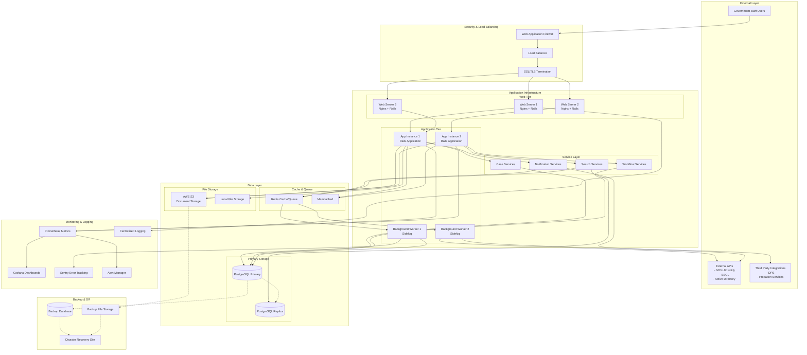
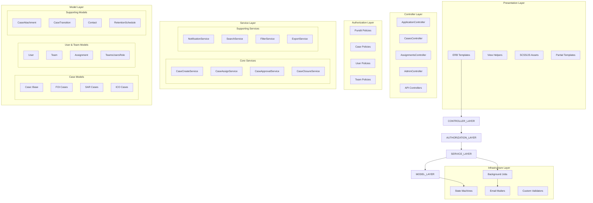
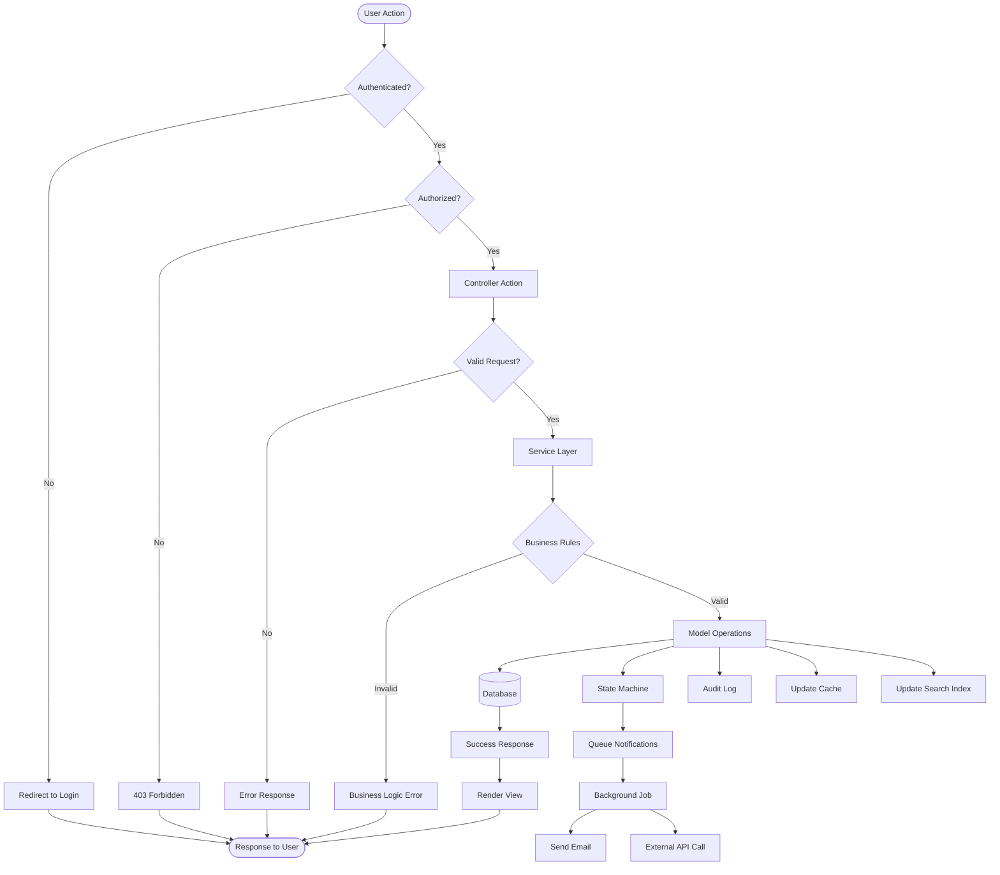
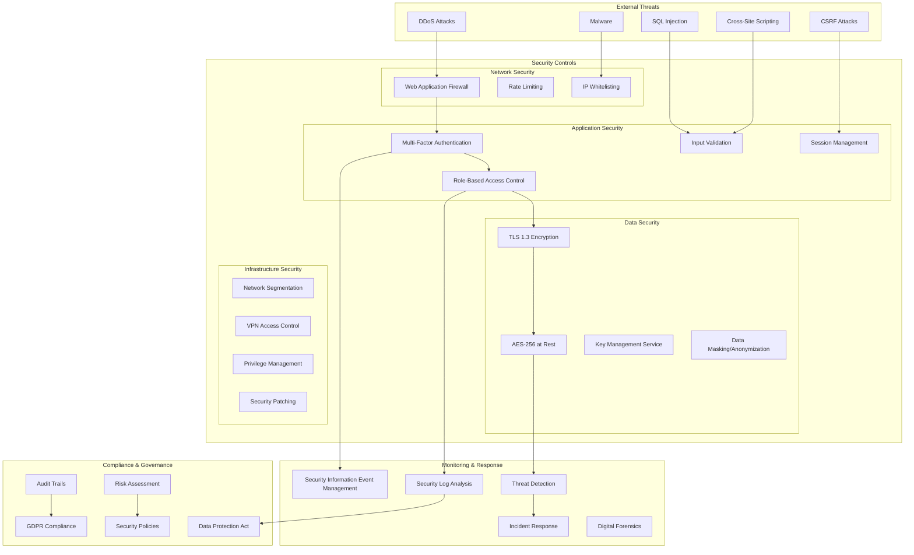
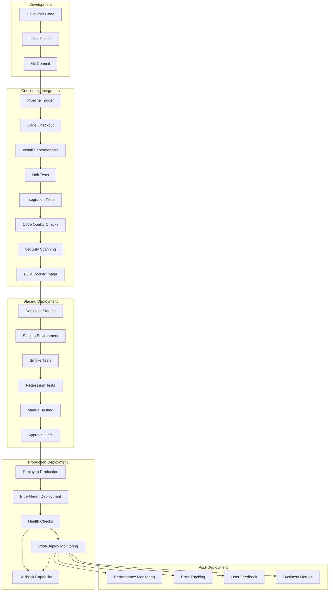
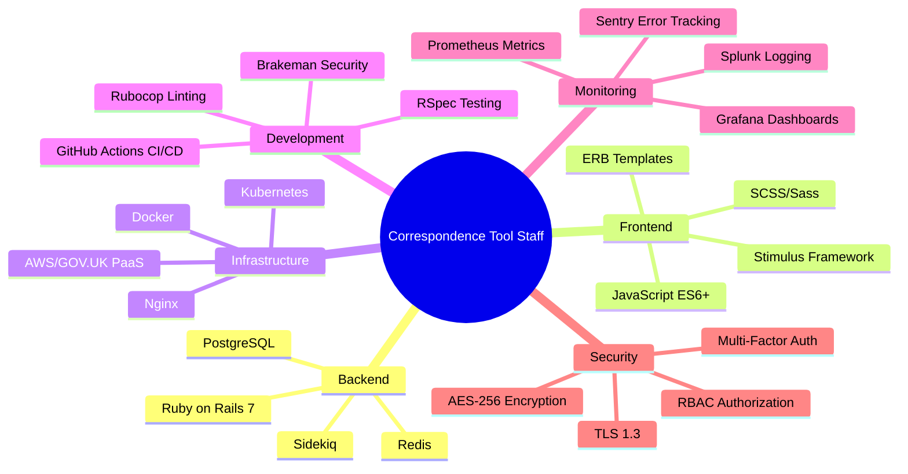

# Complete System Architecture

This document provides a comprehensive visual overview of the entire Correspondence Tool Staff system architecture.

## Master Architecture Diagram

## Application Component Architecture

## Data Flow Architecture

## Security Architecture

## Integration Architecture

```mermaid
graph TB
    subgraph "Internal Systems"
        CTS[Correspondence Tool Staff]
        WAREHOUSE[Data Warehouse]
        REPORTING[Reporting System]
        ADMIN_TOOLS[Admin Tools]
    end
    
    subgraph "Government Systems"
        GOV_NOTIFY[GOV.UK Notify<br/>Email/SMS Service]
        GOV_SSO[Government Single Sign-On]
        GOV_PAAS[GOV.UK Platform as a Service]
        DIGITAL_MARKETPLACE[Digital Marketplace]
    end
    
    subgraph "Ministry of Justice Systems"
        SSCL[Shared Services Connected Limited]
        DPS[Digital Prison Service]
        PROBATION[National Probation Service]
        HMCTS[HM Courts & Tribunals Service]
    end
    
    subgraph "External Services"
        AWS_S3[AWS S3 Storage]
        SENTRY[Sentry Error Tracking]
        GITHUB[GitHub Source Control]
        SLACK[Slack Notifications]
    end
    
    subgraph "Integration Patterns"
        REST_API[REST API]
        WEBHOOK[Webhooks]
        FILE_TRANSFER[File Transfer]
        MESSAGE_QUEUE[Message Queue]
        DATABASE_SYNC[Database Sync]
    end
    
    %% Internal integrations
    CTS --> WAREHOUSE
    CTS --> REPORTING
    CTS --> ADMIN_TOOLS
    
    %% Government integrations
    CTS --> GOV_NOTIFY
    CTS --> GOV_SSO
    CTS --> GOV_PAAS
    
    %% MoJ integrations
    CTS --> SSCL
    CTS --> DPS
    CTS --> PROBATION
    CTS --> HMCTS
    
    %% External integrations
    CTS --> AWS_S3
    CTS --> SENTRY
    CTS --> GITHUB
    CTS --> SLACK
    
    %% Integration patterns
    WAREHOUSE --> DATABASE_SYNC
    GOV_NOTIFY --> REST_API
    SSCL --> FILE_TRANSFER
    DPS --> WEBHOOK
    SLACK --> MESSAGE_QUEUE
```

## Deployment Pipeline

## Technology Stack Overview

This comprehensive architecture documentation provides:

1. **Complete system overview** with all major components
2. **Detailed component interactions** and data flows
3. **Security architecture** showing protection layers
4. **Integration patterns** with external systems
5. **Deployment pipeline** from development to production
6. **Technology stack** overview

All diagrams are created using Mermaid syntax and can be viewed in any Markdown viewer that supports Mermaid, including GitHub, VS Code, and dedicated Mermaid viewers.
