# Component Architecture

## Application Layer Structure

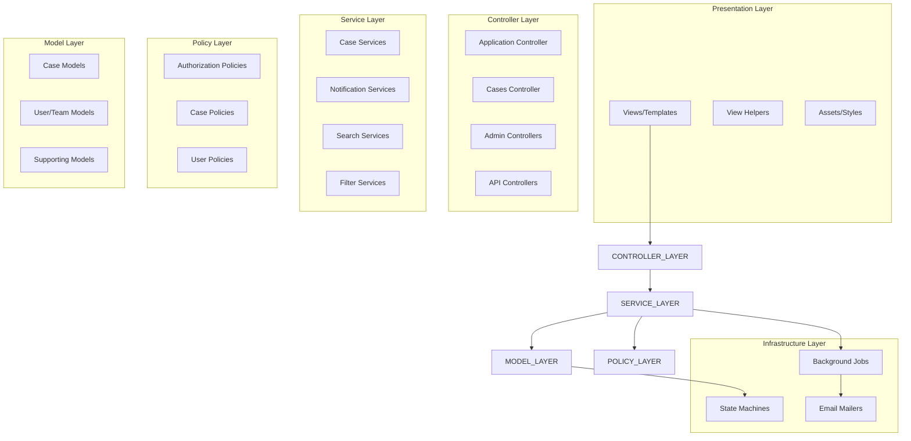

## Detailed Component Breakdown

### 1. Controllers

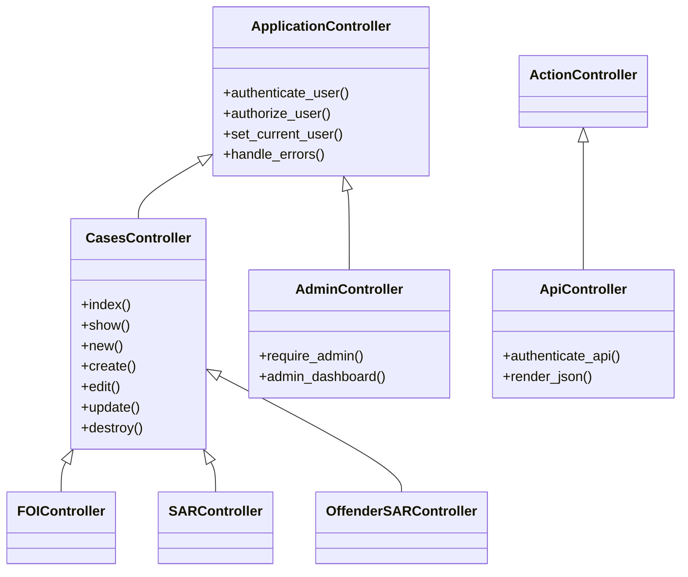

### 2. Service Objects Architecture

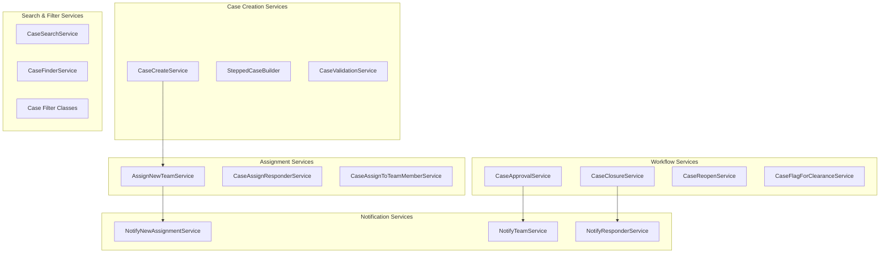

### 3. Model Hierarchy

```mermaid
classDiagram
    class ApplicationRecord {
        +id: integer
        +created_at: datetime
        +updated_at: datetime
    }
    
    class CaseBase {
        +number: string
        +name: string
        +email: string
        +subject: string
        +message: text
        +received_date: date
        +deadline: date
        +workflow_state: string
        +validate_case_data()
        +assign_to_team()
        +close_case()
    }
    
    class User {
        +email: string
        +full_name: string
        +role: string
        +teams: Team[]
        +cases: Case[]
        +authenticate()
        +authorize()
    }
    
    class Team {
        +name: string
        +team_type: string
        +users: User[]
        +parent_team: Team
        +child_teams: Team[]
        +can_handle_case_type()
    }
    
    class Assignment {
        +state: string
        +role: string
        +assigned_at: datetime
        +user: User
        +team: Team
        +case: Case
    }
    
    ApplicationRecord <|-- CaseBase
    ApplicationRecord <|-- User
    ApplicationRecord <|-- Team
    ApplicationRecord <|-- Assignment
    
    CaseBase <|-- FOIStandard
    CaseBase <|-- SARStandard
    CaseBase <|-- OffenderSAR
    CaseBase <|-- ICOCase
    
    User ||--o{ Assignment
    Team ||--o{ Assignment
    CaseBase ||--o{ Assignment
```

### 4. State Machine Architecture

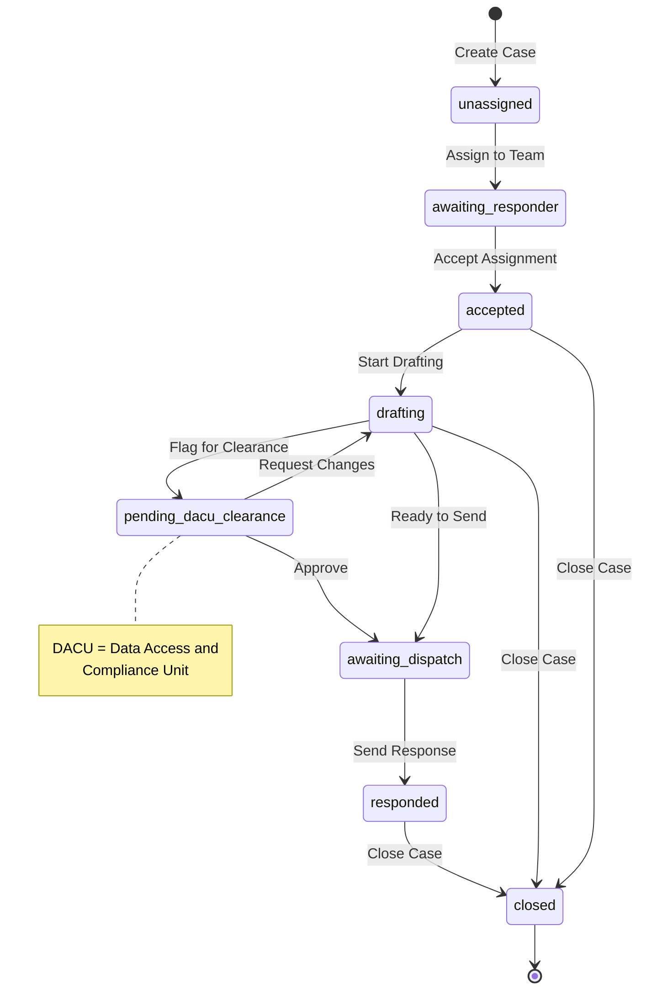

### 5. Policy Architecture

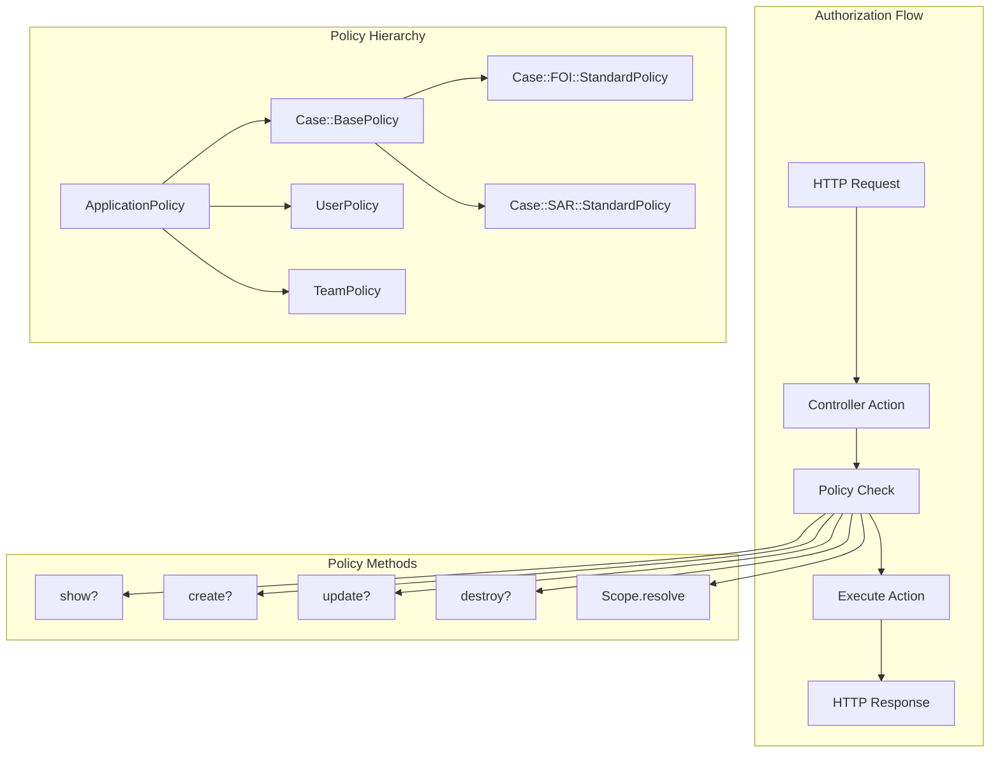

## Service Layer Patterns

### 1. Command Pattern
Services follow the command pattern with a single `call` method:

```ruby
class CaseCreateService
  def self.call(user:, case_type:, params:)
    new(user: user, case_type: case_type, params: params).call
  end
  
  def call
    validate_params
    create_case
    assign_initial_team
    send_notifications
    case
  end
end
```

### 2. Factory Pattern
Case creation uses factory pattern for different case types:

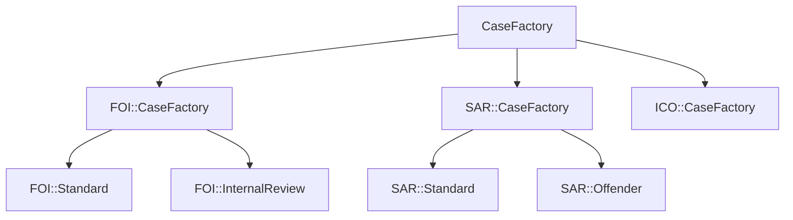

### 3. Observer Pattern
State changes trigger notifications:

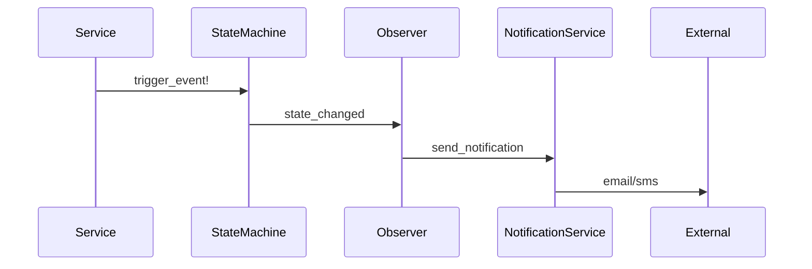

## Component Interaction Patterns

### 1. Case Creation Flow

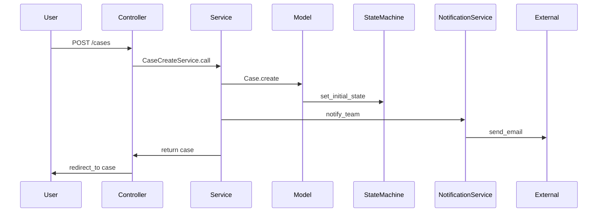

### 2. Assignment Flow

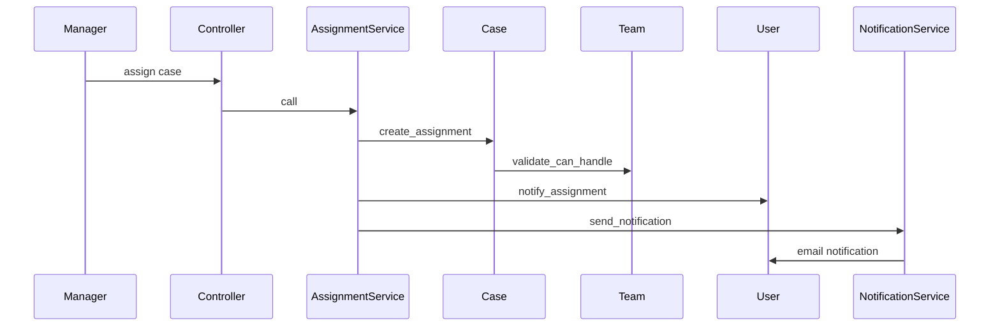

### 3. Approval Workflow

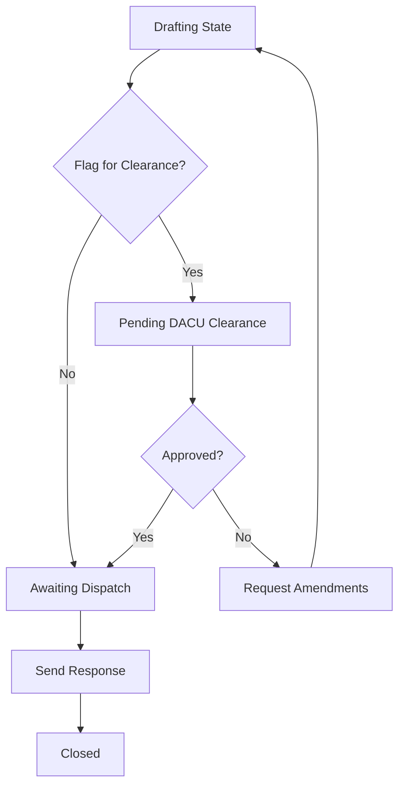

## Background Job Architecture

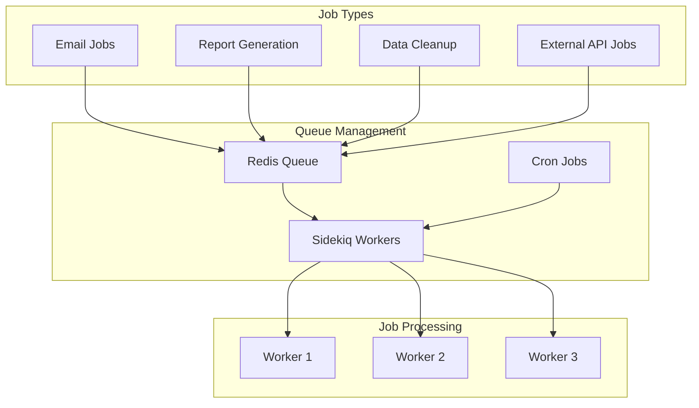

## Integration Points

### External Service Integration

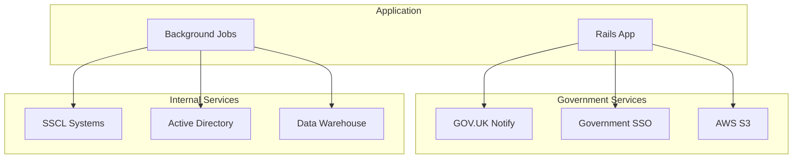

## Error Handling Strategy

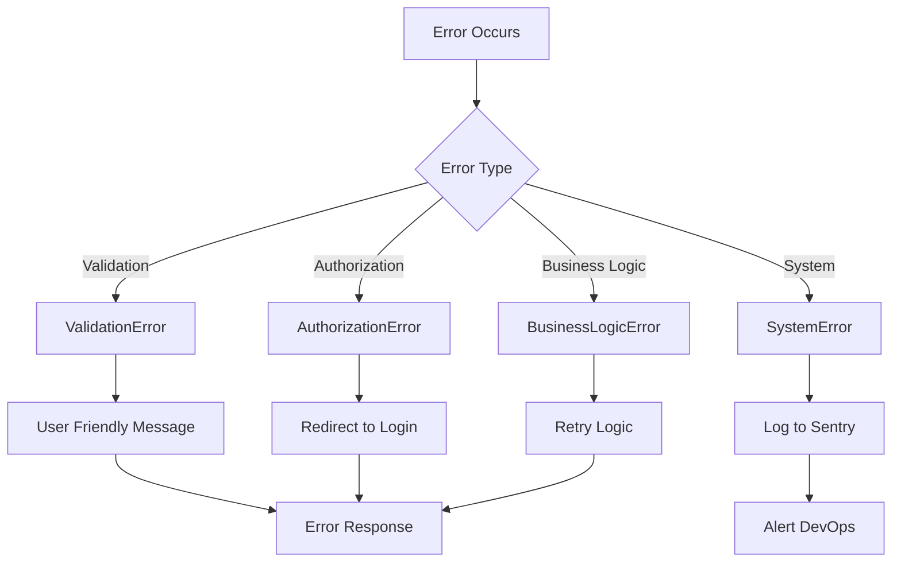
