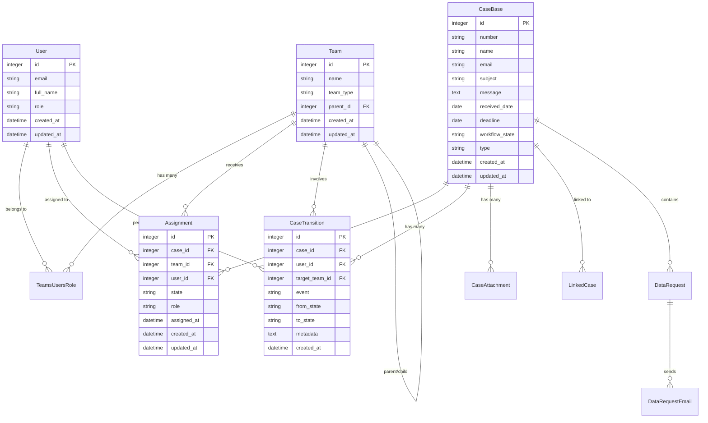

# Data Model Architecture

## Entity Relationship Overview



## Case Type Hierarchy


## Team Structure & Hierarchy


## User Roles & Permissions


## Case State Transitions


## Document Management Schema


## Data Request System


## Audit and Compliance Schema


## Reporting and Analytics Schema


## Database Performance Considerations

### Indexes

```sql
-- Core case lookup indexes
CREATE INDEX idx_cases_number ON cases(number);
CREATE INDEX idx_cases_workflow_state ON cases(workflow_state);
CREATE INDEX idx_cases_received_date ON cases(received_date);
CREATE INDEX idx_cases_deadline ON cases(deadline);
CREATE INDEX idx_cases_type ON cases(type);

-- Assignment indexes
CREATE INDEX idx_assignments_case_team ON assignments(case_id, team_id);
CREATE INDEX idx_assignments_user_state ON assignments(user_id, state);
CREATE INDEX idx_assignments_team_state ON assignments(team_id, state);

-- Transition tracking
CREATE INDEX idx_transitions_case_date ON case_transitions(case_id, created_at);
CREATE INDEX idx_transitions_user_date ON case_transitions(user_id, created_at);

-- Full-text search
CREATE INDEX idx_cases_search ON cases USING gin(to_tsvector('english', subject || ' ' || message));
```

### Data Partitioning Strategy


## Data Migration Patterns

### Case Type Migration


### Data Cleanup Patterns


