# Deployment Architecture

## Infrastructure Overview

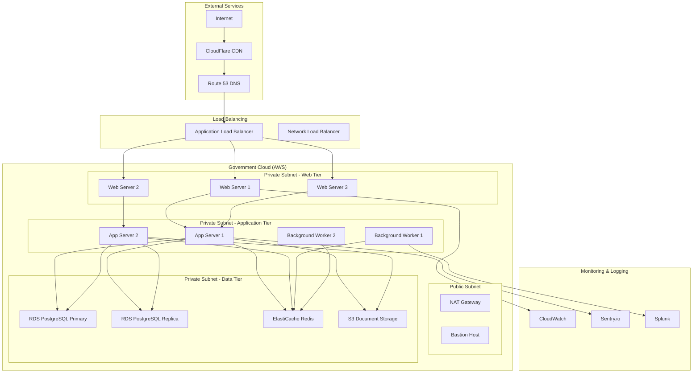

## Container Architecture (Kubernetes)

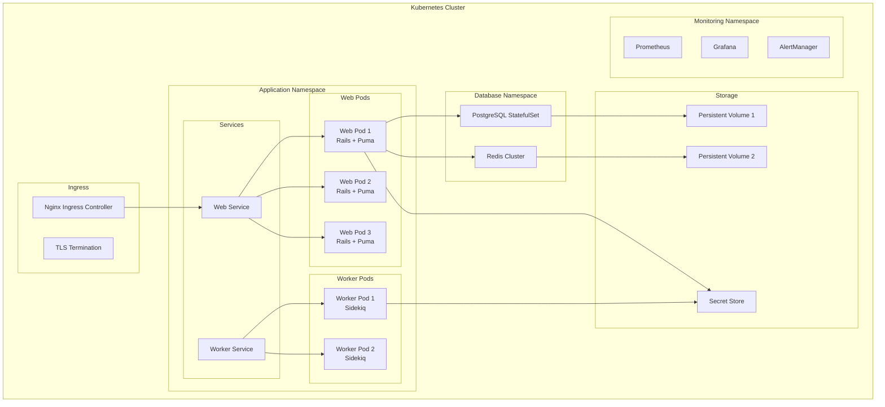

## Environment Architecture

### Development Environment

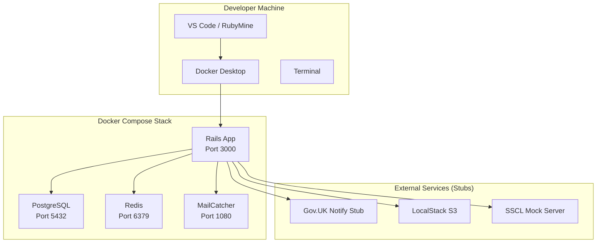

### Staging Environment

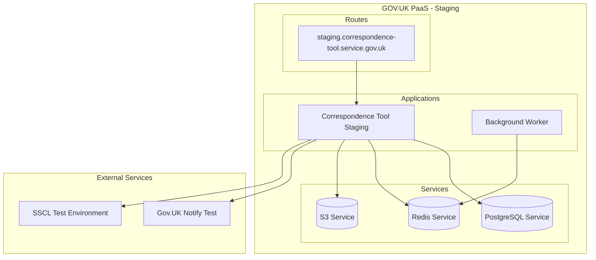

### Production Environment

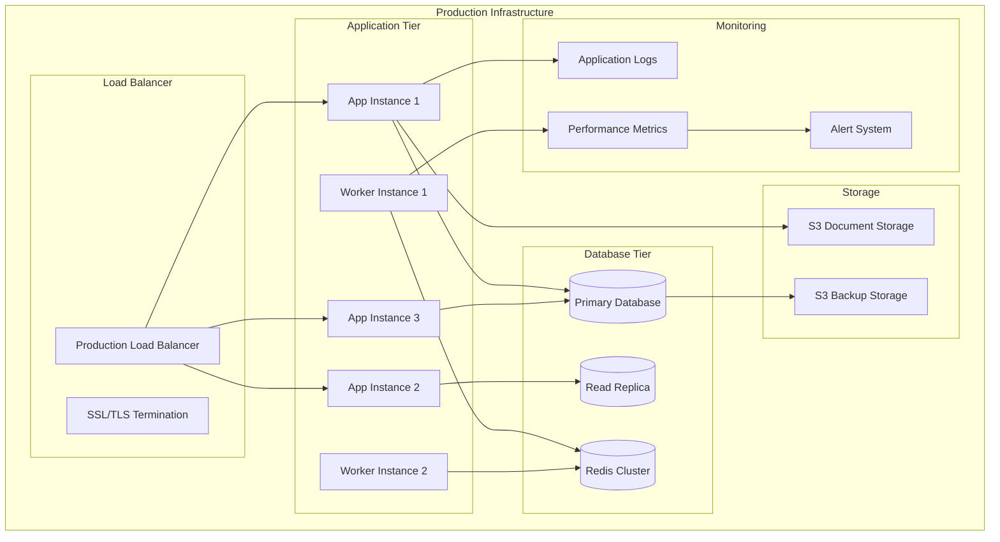

## CI/CD Pipeline

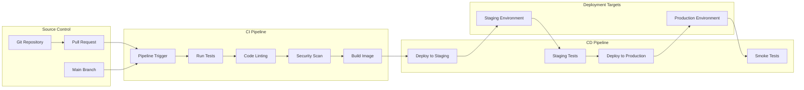

## Security Architecture

### Network Security

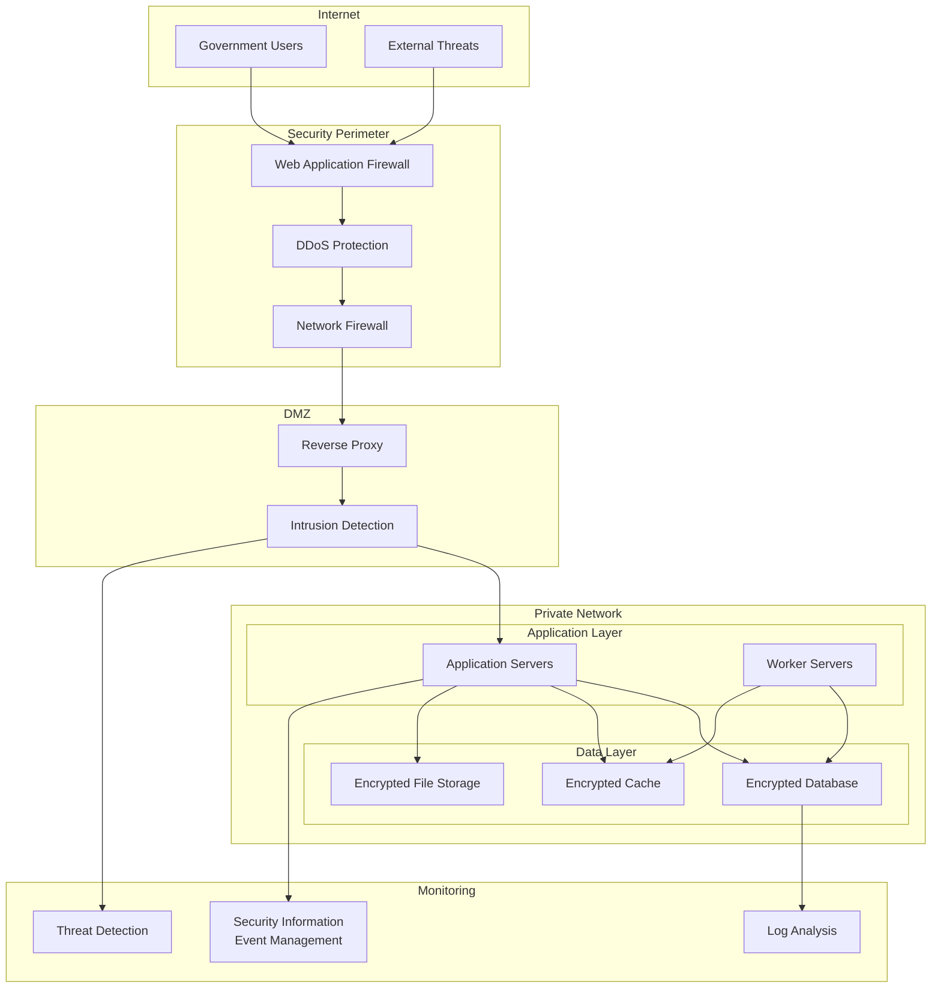

### Data Protection

```mermaid
graph TB
    subgraph "Data Classification"
        OFFICIAL[OFFICIAL]
        OFFICIAL_SENSITIVE[OFFICIAL-SENSITIVE]
        SECRET[SECRET (if required)]
    end
    
    subgraph "Encryption"
        TLS[TLS 1.3 in Transit]
        AES[AES-256 at Rest]
        KEY_MANAGEMENT[AWS KMS Key Management]
    end
    
    subgraph "Access Control"
        IAM[Identity & Access Management]
        MFA[Multi-Factor Authentication]
        RBAC[Role-Based Access Control]
        AUDIT[Access Audit Logs]
    end
    
    subgraph "Data Handling"
        BACKUP[Encrypted Backups]
        RETENTION[Data Retention Policies]
        DISPOSAL[Secure Data Disposal]
        GDPR[GDPR Compliance]
    end
    
    OFFICIAL --> TLS
    OFFICIAL_SENSITIVE --> AES
    SECRET --> KEY_MANAGEMENT
    
    IAM --> MFA
    MFA --> RBAC
    RBAC --> AUDIT
    
    AES --> BACKUP
    BACKUP --> RETENTION
    RETENTION --> DISPOSAL
    DISPOSAL --> GDPR
```

## Monitoring and Observability

### Application Monitoring

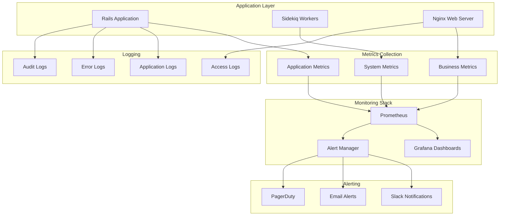

### Performance Monitoring

```mermaid
graph TB
    subgraph "Frontend Monitoring"
        PAGE_LOAD[Page Load Times]
        USER_INTERACTION[User Interactions]
        ERROR_TRACKING[Frontend Errors]
    end
    
    subgraph "Backend Monitoring"
        RESPONSE_TIME[API Response Times]
        THROUGHPUT[Request Throughput]
        ERROR_RATE[Error Rates]
        QUEUE_DEPTH[Job Queue Depth]
    end
    
    subgraph "Infrastructure Monitoring"
        CPU_USAGE[CPU Usage]
        MEMORY_USAGE[Memory Usage]
        DISK_IO[Disk I/O]
        NETWORK_IO[Network I/O]
    end
    
    subgraph "Database Monitoring"
        QUERY_PERFORMANCE[Query Performance]
        CONNECTION_POOL[Connection Pool]
        REPLICATION_LAG[Replication Lag]
        DEADLOCKS[Deadlock Detection]
    end
    
    subgraph "Alerting Thresholds"
        CRITICAL[Critical Alerts<br/>> 95th percentile]
        WARNING[Warning Alerts<br/>> 90th percentile]
        INFO[Info Alerts<br/>> 80th percentile]
    end
    
    PAGE_LOAD --> CRITICAL
    RESPONSE_TIME --> WARNING
    CPU_USAGE --> INFO
    QUERY_PERFORMANCE --> CRITICAL
```

## Disaster Recovery

### Backup Strategy

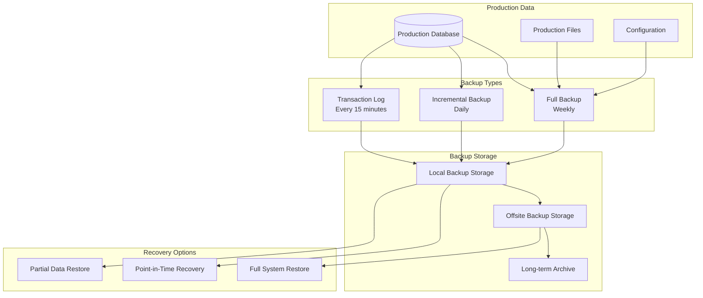

### Failover Architecture

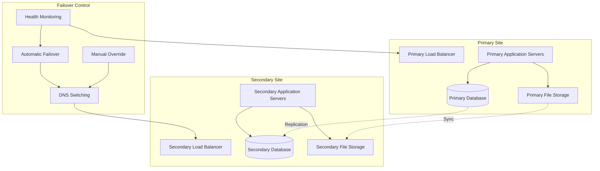

## Scalability Architecture

### Horizontal Scaling

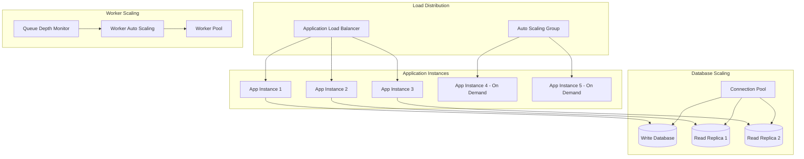

### Performance Optimization

```mermaid
graph TB
    subgraph "Caching Strategy"
        CDN[Content Delivery Network]
        APP_CACHE[Application Cache]
        DB_CACHE[Database Query Cache]
        SESSION_CACHE[Session Cache]
    end
    
    subgraph "Database Optimization"
        INDEX_OPTIMIZATION[Index Optimization]
        QUERY_OPTIMIZATION[Query Optimization]
        PARTITIONING[Table Partitioning]
        ARCHIVING[Data Archiving]
    end
    
    subgraph "Application Optimization"
        CODE_OPTIMIZATION[Code Optimization]
        ASYNC_PROCESSING[Async Processing]
        BACKGROUND_JOBS[Background Jobs]
        API_OPTIMIZATION[API Optimization]
    end
    
    CDN --> APP_CACHE
    APP_CACHE --> DB_CACHE
    DB_CACHE --> SESSION_CACHE
    
    INDEX_OPTIMIZATION --> QUERY_OPTIMIZATION
    QUERY_OPTIMIZATION --> PARTITIONING
    PARTITIONING --> ARCHIVING
    
    CODE_OPTIMIZATION --> ASYNC_PROCESSING
    ASYNC_PROCESSING --> BACKGROUND_JOBS
    BACKGROUND_JOBS --> API_OPTIMIZATION
```
