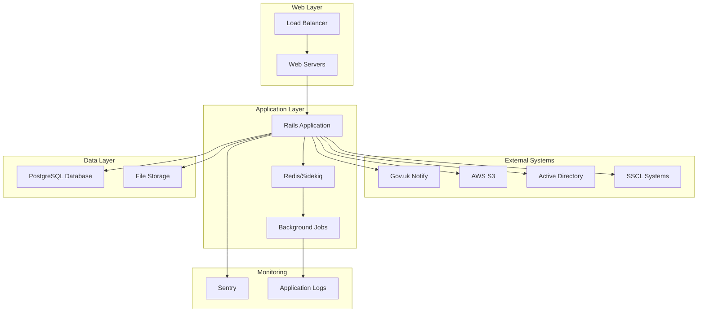
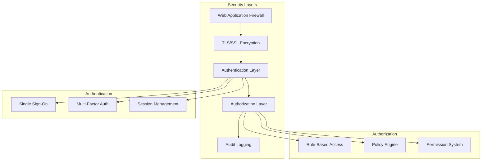
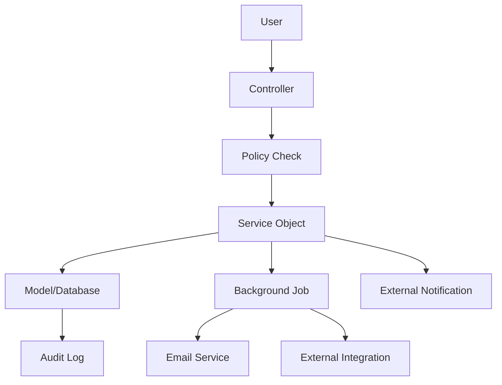

# System Overview

## Introduction

The Correspondence Tool Staff is a Ruby on Rails application designed to manage government correspondence, including Freedom of Information (FOI) requests, Subject Access Requests (SAR), and various types of case management workflows.

## High-Level Architecture

## System Components

### Web Layer
- **Load Balancer**: Distributes incoming requests across multiple application instances
- **Web Servers**: Serve the Rails application (typically Puma servers)

### Application Layer
- **Rails Application**: Core business logic and web interface
- **Redis/Sidekiq**: Background job processing for asynchronous tasks
- **Background Jobs**: Handle email notifications, data processing, and integrations

### Data Layer
- **PostgreSQL Database**: Primary data store for all application data
- **File Storage**: Handles document uploads and attachments (AWS S3 or local storage)

### External Integrations
- **Gov.uk Notify**: Government notification service for emails and SMS
- **AWS S3**: Cloud storage for documents and attachments
- **Active Directory**: User authentication and authorization
- **SSCL Systems**: Shared Services Connected Limited integrations

## Architecture Principles

### 1. **Separation of Concerns**
- Controllers handle HTTP requests and responses
- Services encapsulate business logic
- Models represent data and domain logic
- Policies manage authorization

### 2. **Service-Oriented Design**
- Business operations are encapsulated in service objects
- Clear interfaces between components
- Reusable and testable business logic

### 3. **State Machine Driven Workflows**
- Complex case workflows managed by state machines
- Ensures valid state transitions
- Auditable state changes

### 4. **Policy-Based Authorization**
- Pundit-style policies for access control
- Role-based permissions
- Fine-grained authorization rules

## Technology Stack

### Backend
- **Ruby on Rails 7.x**: Web application framework
- **PostgreSQL**: Primary database
- **Redis**: Caching and job queue
- **Sidekiq**: Background job processing

### Frontend
- **HTML/ERB**: Server-side rendered templates
- **SCSS**: Styling with government design system
- **JavaScript**: Progressive enhancement
- **Stimulus**: Modest JavaScript framework

### Infrastructure
- **Docker**: Containerization
- **Kubernetes**: Container orchestration
- **AWS**: Cloud infrastructure
- **GOV.UK PaaS**: Platform as a Service

### Development Tools
- **RSpec**: Testing framework
- **Rubocop**: Code linting
- **Brakeman**: Security scanning
- **GitHub Actions**: CI/CD pipeline

## Security Architecture

### Security Features
- **Authentication**: Integration with government SSO systems
- **Authorization**: Role-based access control with fine-grained permissions
- **Data Protection**: Encryption at rest and in transit
- **Audit Trail**: Comprehensive logging of all user actions
- **Security Headers**: CSRF protection, content security policy

## Performance Characteristics

### Scalability
- **Horizontal Scaling**: Multiple application instances behind load balancer
- **Database Scaling**: Read replicas and connection pooling
- **Caching**: Redis-based caching for frequently accessed data
- **Background Processing**: Asynchronous job processing for heavy operations

### Monitoring
- **Application Performance**: Sentry for error tracking and performance monitoring
- **Infrastructure Monitoring**: Kubernetes-native monitoring
- **Custom Metrics**: Business-specific metrics and dashboards
- **Log Aggregation**: Centralized logging for troubleshooting

## Data Flow Overview

## Key Business Domains

### Case Management
- **FOI Cases**: Freedom of Information requests
- **SAR Cases**: Subject Access Requests  
- **Complaint Cases**: Offender complaints and appeals
- **ICO Cases**: Information Commissioner's Office appeals

### User Management
- **Staff Users**: Government employees handling cases
- **Teams**: Organizational units (Business Groups, Directorates)
- **Roles**: Permission-based role assignments

### Document Management
- **Attachments**: Case-related documents and files
- **Templates**: Standard response templates
- **Cover Pages**: Generated cover sheets for responses

### Workflow Management
- **Assignments**: Case assignment to teams and individuals
- **Approvals**: Multi-stage approval processes
- **Deadlines**: Statutory and internal deadline tracking
- **Extensions**: Deadline extension management
