# Service Architecture

## Service Layer Overview

The service layer encapsulates business logic and orchestrates complex operations across multiple models. Services follow consistent patterns and conventions for maintainability and testability.


## Core Service Architecture

### 1. Case Management Services


### 2. Workflow State Management


### 3. Assignment Service Flow


## Service Pattern Implementation

### 1. Command Pattern Services

```ruby
class CaseCreateService
  include ServiceResult
  
  def self.call(**args)
    new(**args).call
  end
  
  def initialize(user:, case_type:, params:)
    @user = user
    @case_type = case_type
    @params = params
  end
  
  def call
    validate_permissions!
    build_case
    assign_initial_team
    send_notifications
    
    ServiceResult.success(case: @case)
  rescue => error
    ServiceResult.failure(error: error)
  end
  
  private
  
  def validate_permissions!
    raise UnauthorizedError unless can_create_case?
  end
  
  def build_case
    @case = @case_type.constantize.create!(@params)
  end
  
  def assign_initial_team
    DefaultTeamService.call(case: @case, user: @user)
  end
  
  def send_notifications
    NotifyNewCaseService.call(case: @case)
  end
end
```

### 2. Strategy Pattern for Notifications


### 3. Factory Pattern for Case Creation


## Search and Filter Service Architecture

### 1. Filter Chain Pattern


### 2. Search Service Implementation


### 3. Filter Configuration

```yaml
# config/case_filters.yml
filters:
  date_received:
    class_name: CaseFilter::ReceivedDateFilter
    template: date_range
    default_params:
      start_date: -30.days
      end_date: today
      
  case_status:
    class_name: CaseFilter::CaseStatusFilter
    template: multi_select
    options:
      - unassigned
      - awaiting_responder
      - drafting
      - pending_clearance
      - closed
      
  assigned_team:
    class_name: CaseFilter::TeamFilter
    template: team_select
    scope: user_teams
```

## Background Job Services

### 1. Job Categories and Queues


### 2. Email Service Architecture


### 3. Report Generation Service

```mermaid
flowchart TD
    REQUEST[Report Request] --> VALIDATE[Validate Parameters]
    VALIDATE --> QUEUE[Queue Background Job]
    QUEUE --> FETCH[Fetch Data]
    FETCH --> PROCESS[Process Data]
    PROCESS --> GENERATE[Generate Report]
    GENERATE --> STORE[Store File]
    STORE --> NOTIFY[Notify User]
    NOTIFY --> CLEANUP[Schedule Cleanup]
```



## Integration Service Patterns

### 1. External API Integration


### 2. Circuit Breaker Pattern


### 3. Retry Strategy


## Service Testing Patterns

### 1. Service Test Structure

```ruby
RSpec.describe CaseCreateService do
  describe '.call' do
    let(:user) { create(:user) }
    let(:case_type) { 'Case::FOI::Standard' }
    let(:params) { build(:foi_case_params) }
    
    subject(:result) { described_class.call(user: user, case_type: case_type, params: params) }
    
    context 'with valid parameters' do
      it 'creates a new case' do
        expect { result }.to change { Case::FOI::Standard.count }.by(1)
      end
      
      it 'assigns the case to default team' do
        expect(result.case.assignments).to be_present
      end
      
      it 'sends notifications' do
        expect(NotifyNewCaseService).to receive(:call)
        result
      end
    end
    
    context 'with invalid parameters' do
      let(:params) { { subject: nil } }
      
      it 'returns failure result' do
        expect(result).to be_failure
      end
      
      it 'does not create a case' do
        expect { result }.not_to change { Case::FOI::Standard.count }
      end
    end
  end
end
```

### 2. Mock External Services

```ruby
class MockGovNotifyService
  def self.send_email(template:, recipient:, personalisation:)
    Rails.logger.info "Mock email sent to #{recipient}"
    OpenStruct.new(id: SecureRandom.uuid, status: 'delivered')
  end
end

# In test configuration
Rails.application.configure do
  config.gov_notify_service = MockGovNotifyService
end
```

## Performance Optimization

### 1. Service Caching Strategy


### 2. Async Processing


### 3. Database Optimization

```ruby
# Service optimization example
class CaseSearchService
  def call
    # Use includes to avoid N+1 queries
    scope = Case.includes(:assignments, :transitions, :attachments)
    
    # Apply filters efficiently
    scope = apply_filters(scope)
    
    # Use counter cache for counts
    scope = scope.select('cases.*, assignments_count, transitions_count')
    
    # Paginate results
    scope.page(page).per(per_page)
  end
  
  private
  
  def apply_filters(scope)
    filters.reduce(scope) do |current_scope, filter|
      filter.apply(current_scope)
    end
  end
end
```
